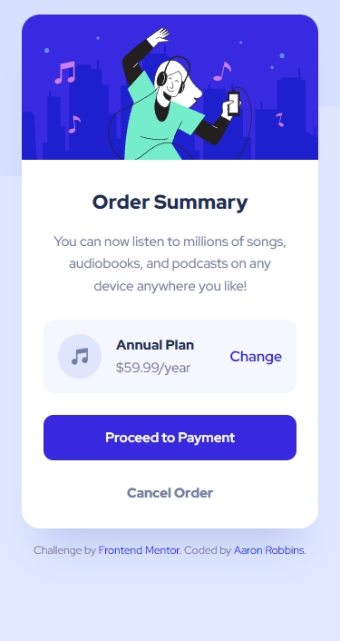
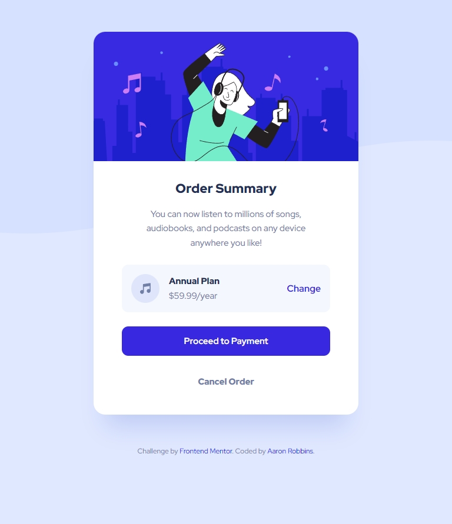
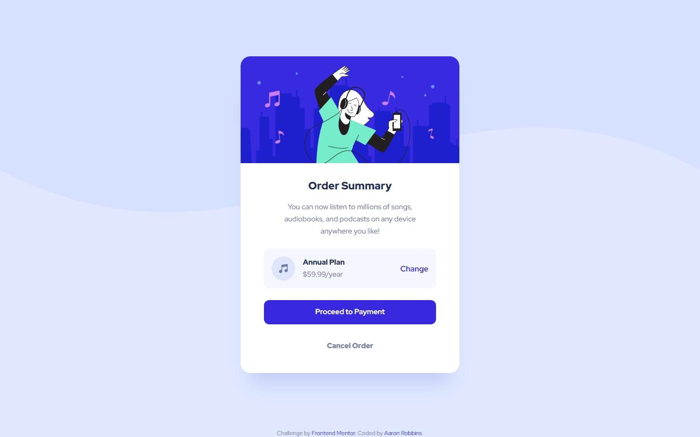

# Frontend Mentor - Order summary card solution

This is a solution to the [Order summary card challenge on Frontend Mentor](https://www.frontendmentor.io/challenges/order-summary-component-QlPmajDUj). Frontend Mentor challenges help you improve your coding skills by building realistic projects.

## Table of contents

- [Overview](#overview)
  - [The challenge](#the-challenge)
  - [Screenshot](#screenshot)
  - [Links](#links)
- [My process](#my-process)
  - [Built with](#built-with)
  - [What I learned](#what-i-learned)
  - [Continued development](#continued-development)
  - [Useful resources](#useful-resources)
  - [AI Collaboration](#ai-collaboration)
- [Author](#author)
- [Acknowledgments](#acknowledgments)

## Overview

### The challenge

Users should be able to:

- See hover states for interactive elements

### Screenshot





### Links

- [Solution URL](https://your-solution-url.com)
- [Live Site URL](https://freexm1nd.github.io/order-summary-component/)

## My process

### Built with

- Semantic HTML5 markup
- CSS custom properties
- Flexbox
- Mobile-first workflow

### What I learned

I trialed some nesting in native CSS for this project in one section of CSS. I want to experiement with this function more in future projects.

To see how you can add code snippets, see below:

```css
.credits {
  text-align: center;
  font-size: var(--font-size-12);
  color: var(--gray);
  & .link {
    text-decoration: none;
  }

  & .link:hover {
    text-decoration: underline;
  }

  & .link:visited {
    color: var(--blue-700);
  }
}
```

### Continued development

I want to explore newer features in native CSS. I now know that nesting is a feature that wasn't there before. It could prove to be very valuable info. At some point in the future I want to learn Sass, but having a really solid foundation with native will help.

### Useful resources

Kevin Powell's crash course on nesting in CSS helped me accomplish some nesting in this project.

- [Nesting in CSS](https://www.youtube.com/watch?v=h4Xp1QgNkhU)

I continue to use Responsively to look at my designs on various screen sizes and to take screenshots.

- [Responsively App](https://responsively.app/)

### AI Collaboration

I used Claude in this challenge to assist in brainstorming solutions and to assist in debugging.

## Author

- GitHub - [Aaron Robbins](https://github.com/FREExM1ND)
- Frontend Mentor - [@FREExM1ND](https://www.frontendmentor.io/profile/FREExM1ND)

## Acknowledgments

Thank you to Kevin Powell for the assist with nesting. I'm eager to dive deeper into some more advanced features of native CSS in preparation to learn Sass.

I'm thankful for the team at Responsively for creating a useful development tool. Thank you to Frontend Mentor for the challenge. I'm eager to do more.
